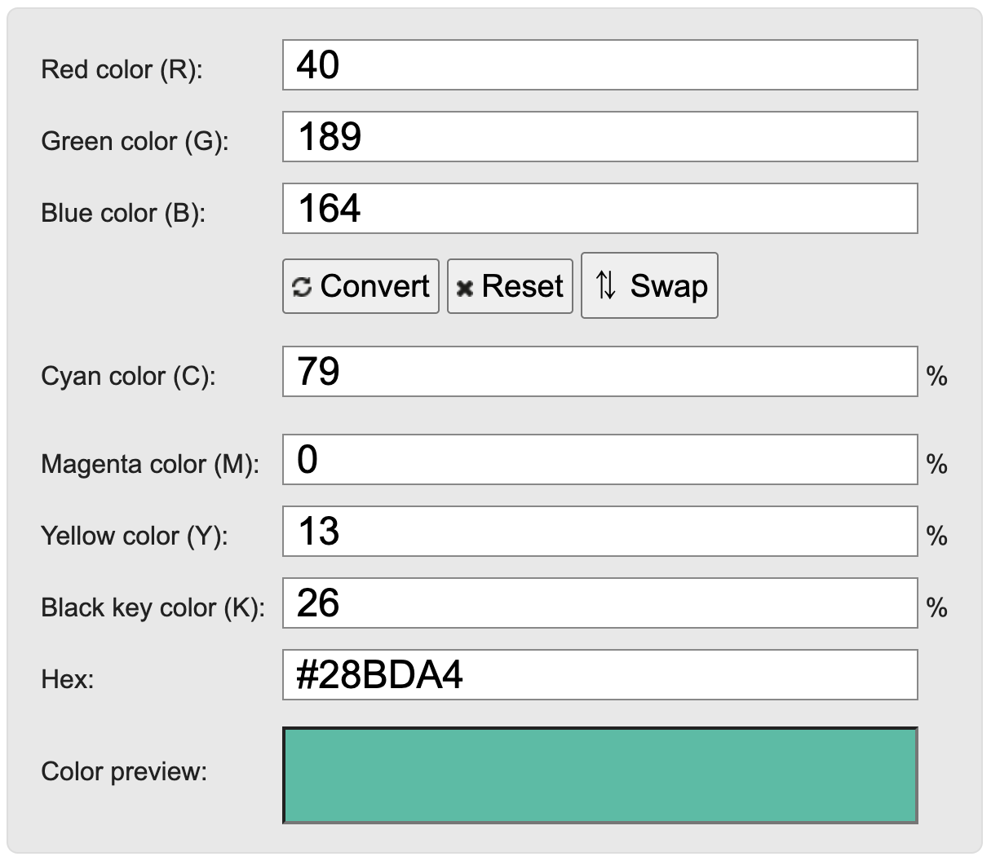
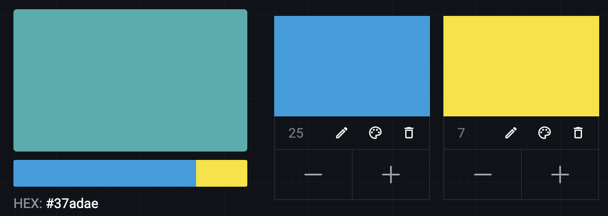

# Converting RGB to Process CMYK

This process boils down to estimating one color as a combination of a set of 4 other colors. When the process is RGB to CMYK there are shortcuts we can take, but for process CMYK colors, which are slightly different, we can go to linear algebra.

Essentially we can treat a color as a 4d vector. We want to estimate a given target color x as a combination of four other colors v1, v2, v3, v4, added together at a certain proportion. This is the same as calculating a linear combination of four vectors that sums to the target vector. (Actually in a linear combination you can subtract vectors, but here we need to restrict the space so we can only add vectors since you can't print negative ink.)

The code in `colorcalc.py` does this using `numpy` and `scipy`. First it defines v1 through v4 as the process CMYK colors. Then it uses linear algebra to project x into the color space (this projection is lossy because we cannot capture every color). Finally it determines the coefficients that each of v1 through v4 need to be multiplied by to get this approximate vector. This gives us our own version of a CMYK converter.

```
E.g.
x = [40, 189, 164] # that blueish green hue we couldn't get before

v1 = [0, 159, 223] # process cyan
v2 = [212, 15, 125] # process magenta
v3 = [250, 225, 0] # process yellow
v4 = [44, 42, 41] # process black
```
After runnnig the code to calculate the approximation and the coefficients:

```
proj_x= [ 54, 173, 175 ] #  this is the approximation of x that we are targetting
c = [255, 0, 70, 0] # these are the coefficients, scaled to 255

# compare this to the typical CMYK conversion [79, 0, 13, 26]
```

We can double-check this calculation using an online [color mixer](https://colordesigner.io/color-mixer), using the process CMYK values as base swatches. If we mix together a proportion of 255 cyan to 70 yellow, we get something close to the correct color. (Since I'm not totally sure about how the pattern is created on your end, it would be great to verify that this works with your demo as well.)

## Reference images
See the original color here, and the typical CMYK conversion:


See the digitally mixed approximate color using the process CMYK and our vector math.


